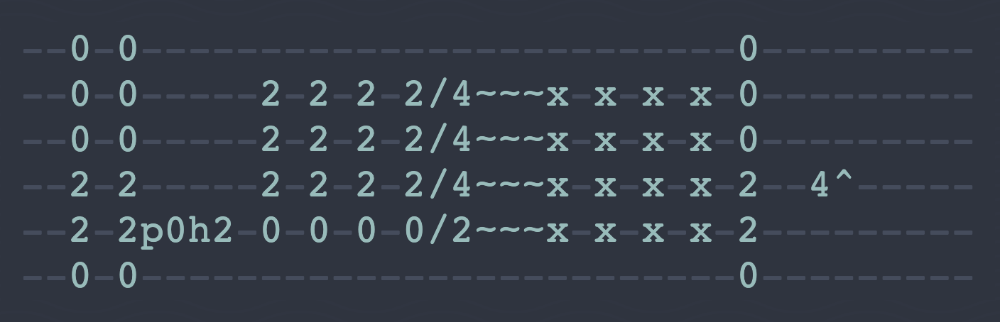
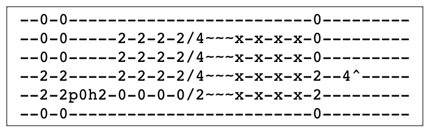

# 🎸 RIFFIN TAB EDITOR 🌊

The custom tablature editor I built for my RIFFIN project is now open source! This editor takes the hassle out of managing dashes and has a duplicate chord feature. The double-layered textarea emphasizes what matters, the tablature, and allows for flexible styling.

Plug and play. Hack and slash. Enjoy!

Demo Style:


Naked editor:



## How to use the editor in your projects
1) Add the riffin-editor.js script to \<head>
2) Add the riffin-editor-style.css stylesheet to \<head>
3) Plug the editor into your HTML
```
  <div id="riffin-editor">
    <textarea cols="40" rows="6" maxlength="251" id="riffin-editor-dashGrid"></textarea>
    <textarea cols="40" rows="6" maxlength="251" id="riffin-editor-inputGrid"></textarea>
  </div>
```

🚨 Currently the editor only supports the textarea tags as they are written above. Any edits to the cols, rows, or maxlength will break the editor.


## Supported inputs
RIFFIN TAB EDITOR accepts the following inputs:
  * backspace - delete
  * d  - duplicate chord
  * ~  - vibrato
  * /  - slide
  * ^  - bend
  * x  - mute
  * p  - pull off
  * h  - hammer on
  * 0
  * 1
  * 2
  * 3
  * 4
  * 5
  * 6
  * 7
  * 8
  * 9

## Desired features
* Flexible textarea size
* copy / paste 